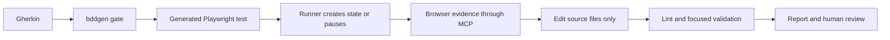

# AI-Native UI Automation

A UI automation framework that uses Playwright Test and `playwright-bdd`. It
compiles Gherkin into Playwright tests. Two agent workflows are part of the
framework:

- The **step implementor** implements missing steps from live browser evidence.
- The **test healer** repairs tests that passed before and now fail.

The agent does not edit tests until they pass. The Gherkin is the business
specification, and the agent cannot change it. Generated tests are build
output. Generation and architecture checks protect each test run.

## Why the agents need guardrails

Agents make predictable mistakes in UI automation. An agent can change the
specification, edit generated files, guess a locator from a snapshot, or use a
browser state that the test runner did not create. This framework makes each
risk an explicit rule:

- **Frozen specification:** The agent never changes the Gherkin to make a
  scenario pass.
- **Generation gate:** `bddgen` must pass before each debug run, replay, or
  direct Playwright run.
- **Runner-owned state:** Playwright creates the state of the existing steps
  (`ctx`, fixtures, and API data). The agent does not imitate it in a paused
  browser.
- **Locator evidence:** Each new locator comes from Playwright tool output. The
  agent does not build a locator from the text of an accessibility snapshot.
- **Honest stops:** When the agent proves that required content is not on the
  page, it reports a scenario or data problem. It does not make a false green
  result.



## Two agent workflows

| Workflow                                                                                     | Use it for                                                            | What keeps it under control                                                                                                                      |
| -------------------------------------------------------------------------------------------- | --------------------------------------------------------------------- | ------------------------------------------------------------------------------------------------------------------------------------------------ |
| [`playwright-bdd-step-implementor`](.claude/skills/playwright-bdd-step-implementor/SKILL.md) | Missing bindings, TODO steps, or a requested change to a passing step | TODO-block limits, runner-owned state, generation before each run, locator evidence, limited retries, and edits to source files only             |
| [`playwright-bdd-test-healer`](.claude/skills/playwright-bdd-test-healer/SKILL.md)           | A scenario with all steps bound that passed before and now fails      | Failure triage, focused verification, Page Object repairs, no edits to generated files, no `fixme`, and a human decision for spec or data errors |

The skills in this repository are the same skills that the local demos use.
This repository has no Gemini mirror and no Gemini evaluation, so we make no
claim for Gemini.

The [`requirement-context-retrieval`](.claude/skills/requirement-context-retrieval/SKILL.md)
skill helps the step implementor. It searches the requirement wiki in
[ai-native-test-design](https://github.com/DerrickDeng/ai-native-test-design),
and it checks the version of each cited story or note before the agent uses a
business rule. If the local OpenViking service is not running, the skill starts
it. If the start fails, the skill searches the committed Markdown.

## Evidence

These checks passed on 2026-10-06:

| Check                                                                           | Result     | What it proves                                                 |
| ------------------------------------------------------------------------------- | ---------- | -------------------------------------------------------------- |
| `npm run lint`                                                                  | Pass       | TypeScript and the repository lint rules pass                  |
| `npm run bddgen`                                                                | Pass       | The bound Gherkin compiles to generated tests                  |
| `node --test src/config/framework/__tests__/profile-tags/profile-tags.test.mjs` | 8/8 pass   | Profile tags select the correct profiles                       |
| `npm run test:skills`                                                           | 42/42 pass | Hermetic fixture E2E, framework contracts, and skill contracts |

The deterministic checks prove the workflow mechanics and the guardrails. They
do not prove that every model behaves the same way on every live application.
Do not read them as a claim of general self-healing or autonomous testing.

- [Run the two local workflow demos](docs/demo/README.md). They need no company
  application, account, or network.
- [Read the evaluation methodology](docs/evaluation/methodology.md).
- [Read the evaluation results](docs/evaluation/results.md).

## Quick start

Run all commands in a bash terminal (macOS Terminal, or WSL or Git Bash on
Windows).

You need:

- **Node.js `20.15+`**, which includes npm
- **Google Chrome**, because the framework uses the installed `chrome` channel

Check the versions:

```bash
node --version      # v20.15 or higher
npm --version
```

Install the dependencies and run the tests:

```bash
npm ci
npm test -- --project=hk-sit
```

The `todoMvc` sample needs only internet access. The skill evaluations also
need the local [QA Dashboard](https://github.com/DerrickDeng/qa-dashboard) and
a `.test-data-key` file that Git ignores. See the
[evals README](.claude/skills/playwright-bdd-step-implementor/evals/README.md).

Each test run must select at least one profile with the `--project` option:

```text
hk-sit  hk-uat  sg-sit  sg-uat  tw-sit  tw-uat
```

## Commands

| Purpose                    | Command                                                    |
| -------------------------- | ---------------------------------------------------------- |
| Run one profile            | `npm test -- --project=hk-sit`                             |
| Run one folder             | `npm test -- --project=hk-sit src/features/todoMvc`        |
| Run one scenario by title  | `npm test -- --project=hk-sit --grep "<Scenario title>"`   |
| Filter by tag              | `npm test -- --project=hk-sit --grep "@tag"`               |
| List the selected tests    | `npm test -- --project=hk-sit src/features/todoMvc --list` |
| Run headless               | `npm test -- --project=hk-sit --headless`                  |
| Generate the BDD tests     | `npm run bddgen`                                           |
| Type-check and lint        | `npm run lint`                                             |
| Check framework and skills | `npm run test:skills`                                      |
| Open the Playwright report | `npm run report`                                           |
| Open the Cucumber report   | `npm run report-cucumber`                                  |

`npm test` runs `bddgen` before Playwright. Local runs show the browser. CI
runs are headless.

## Project structure

```text
.
├── src/
│   ├── features/                   # Gherkin: business behavior
│   │   └── todoMvc/
│   │       └── todoList.feature
│   ├── pages/                      # UI: locators, actions, and assertions
│   │   └── todoMvc/
│   │       ├── TodoFooter.ts
│   │       └── TodoPage.ts
│   ├── steps/                      # Glue: Gherkin steps → Page Objects
│   │   └── todoMvc/
│   │       ├── todoFooter.steps.ts
│   │       └── todoPage.steps.ts
│   ├── data/                       # Test data for each system
│   │   └── todoMvc/
│   │       ├── expected/           # Expected values, by region
│   │       ├── inputs/             # Input values, by region and environment
│   │       └── dataHelper.ts       # Shared data access
│   ├── fixtures/                   # Shared Playwright and BDD fixtures
│   ├── utils/                      # Shared utilities, including test-data encryption
│   └── config/
│       ├── profiles.json           # Profile URLs and runtime settings
│       └── framework/              # Profile and tag-selection logic
├── tests/.features-gen/            # Generated tests; do not edit
├── reports/                        # Playwright and Cucumber HTML reports
└── test-results/                   # Traces, screenshots, and videos
```

**One system, one folder name:** Each system uses the same folder name in
`features`, `steps`, `pages`, and `data`. The sample system is `todoMvc`. It
runs against the public TodoMVC demo of Playwright. Nested business areas use
the same hierarchy in all layers, for example `trading/{order,quote}`. Then you
can trace the behavior, automation, UI model, and data of a system across the
layers.

- Features describe business behavior.
- Steps are thin bindings from Gherkin to Page Objects.
- Page Objects own the locators, the interactions, and the page assertions.
- Generated tests, reports, and test artifacts are disposable.

### Active page in a scenario

`src/fixtures/bddTest.ts` creates a `PageContext` from the Playwright `page`
when a fixture or a hook needs it. All Page Objects in the scenario get the
same `PageContext`. `BasePage.page` reads `pageContext.current` each time. So
an existing Page Object can follow a new active page, and you do not need to
create it again. Each new scenario gets a new `PageContext` and a new
Playwright page.

`ctx` keeps business values between steps. `PageContext` keeps only the active
browser page. Page switches belong in a Page Object, and steps call Page
Objects. Step screenshots and development checkpoints also read the current
page. The framework does not have a popup capture, tab selection, or
return-to-main-page method yet.

## Add a Page Object

1. Add the Page Object in `src/pages/<system>/`.
2. Add the profile URLs or runtime settings that it needs to
   `src/config/profiles.json`.
3. Register the Page Object in `src/fixtures/bddTest.ts`.
4. Add the step definitions in `src/steps/<system>/`.
5. Add or update the feature in `src/features/<system>/`.
6. Run `npm run lint` and the related feature.

[`CodeRules.md`](./CodeRules.md) has the implementation rules.

## Profiles

A profile defines where and how a test runs: its region, environment, URLs, and
runtime settings. The profiles are `hk-sit`, `hk-uat`, `sg-sit`, `sg-uat`,
`tw-sit`, and `tw-uat`.

Select at least one profile with the `--project` option:

```bash
npm test -- --project=hk-sit
```

### Profile parameters

Set the values for each profile in
[`src/config/profiles.json`](./src/config/profiles.json):

```json
"hk-sit": {
  "urls": {
    "qaDashboard": "http://127.0.0.1:5174",
    "todoMvc": "https://demo.playwright.dev/todomvc"
  }
}
```

### Profile tags

Add profile tags to a Feature or a Scenario in its `.feature` file. The tags
tell which profiles can run it:

```gherkin
@hk-sit @sg-sit
Feature: Todo list

  Scenario: Add a todo item
    Given the user opens the todo app
    When the user adds the todo "groceries"
```

This Feature runs with `hk-sit` and `sg-sit` only. Profile tags must be exact
lowercase profile names. More than one tag makes an allowlist:

| Tags                      | Supported profiles                                   |
| ------------------------- | ---------------------------------------------------- |
| `@hk-sit`                 | `hk-sit` only                                        |
| `@hk-sit @sg-sit`         | `hk-sit`, `sg-sit`                                   |
| `@hk-sit @hk-uat @sg-uat` | The three listed profiles; `sg-sit` is not supported |
| No profile tag            | All profiles                                         |

- Dimension tags such as `@hk` and `@sit`, uppercase tags, and incorrect
  profile names fail before BDD generation.
- You can put profile tags on a Feature, Rule, Scenario, Scenario Outline, or
  Examples block. The tags are inherited and combined.
- Other tags such as `@smoke` do not change which profiles apply. You can use
  them for Playwright filters:
  ```bash
  npm test -- --project=hk-sit --grep "@smoke"
  ```

## playwright-bdd tags

These tags control how Playwright runs a feature or a scenario:

| Tag               | Purpose                                                                  |
| ----------------- | ------------------------------------------------------------------------ |
| `@skip`           | Skip a test for a short time. Add a comment with the reason and the end. |
| `@fixme`          | Mark a test that is broken or not finished and must not run yet.         |
| `@only`           | Run only the tagged test locally. CI rejects a committed `@only`.        |
| `@slow`           | Mark a test as slow and give it the extended Playwright timeout.         |
| `@fail`           | Declare that the test fails at this time, as expected.                   |
| `@retries:2`      | Change the retry count for the tagged test or suite.                     |
| `@timeout:180000` | Set a timeout in milliseconds. You can use underscores to make it clear. |
| `@mode:parallel`  | Set the execution mode to `default`, `parallel`, or `serial`.            |

Fix or filter tests in the usual way when possible. Use `@only`, `@skip`,
`@fixme`, and `@fail` only for a clear, short-term reason.

## Test reports

Each test run writes reports in `reports/`. Run a profile first. Then open the
report with its command:

| Report          | Location                             | Description                                                               |
| --------------- | ------------------------------------ | ------------------------------------------------------------------------- |
| Playwright HTML | `reports/playwright-html/index.html` | Test results with project groups, steps, errors, and failure attachments. |
| Cucumber HTML   | `reports/cucumber/index.html`        | BDD results by feature and scenario.                                      |
| Cucumber JSON   | `reports/cucumber-report.json`       | Machine-readable JSON report for the QA Dashboard and for analytics.      |

```bash
# Generate reports for one profile
npm test -- --project=hk-sit

# Open the Playwright HTML report
npm run report

# Open the Cucumber HTML report
npm run report-cucumber
```

When a test fails, Playwright keeps screenshots, traces, and local-run videos
in `test-results/`. Git ignores the reports and the test artifacts.

For release-regression evidence, you can take a screenshot after each BDD step.
Set `STEP_SCREENSHOTS=1` for the run:

```bash
STEP_SCREENSHOTS=1 npm test -- --project=hk-sit
```

Both HTML reports attach each screenshot to its step.

## Development rules

- Page Objects own the locators, the page interactions, and the page
  assertions.
- To create and register a new Page Object, follow
  [Add a Page Object](#add-a-page-object).
- Each step file pairs with a Page Object, not with a feature file.
- Step callbacks use the usual `async function` syntax and fixture parameters.
- `ctx` keeps values only in one scenario. The next scenario gets a new `ctx`.
  See [`CodeRules.md`](./CodeRules.md#x--fixtures-and-scenario-context).
- Use Playwright auto-waiting and web-first assertions. Each fixed wait must
  have a comment that tells why it is necessary.
- Follow [`CodeRules.md`](./CodeRules.md) for locator organization and coding
  rules.
