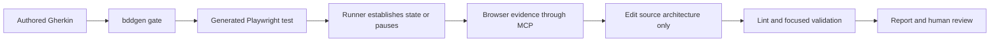

# Evidence-Driven AI-Assisted UI Automation

TypeScript UI automation framework built with Playwright Test and
`playwright-bdd`. It compiles authored Gherkin into native Playwright tests,
while two governed Agent workflows implement missing automation and repair
previously-green tests from live browser evidence.

This is not an LLM that freely edits tests until they pass. Gherkin remains the
frozen business specification, generated tests remain build output, and every
runner invocation is protected by generation and architecture checks.

## Why this is AI-assisted, not just Playwright

Agent-assisted UI automation fails in predictable ways: it can rewrite the
specification, edit generated output, guess a locator from a snapshot, or act
through browser state that the test runner has not established. This repository
turns those risks into explicit engineering constraints:

- **Frozen specifications:** Agent work never changes authored Gherkin merely
  to make a scenario pass.
- **Generation gate:** `bddgen` must succeed before a new debug, replay, or
  direct Playwright runner invocation.
- **Runner-owned state:** existing steps and `ctx`/fixture/API state are
  established by Playwright, not imitated in a paused browser.
- **Locator provenance:** every new locator traces to Playwright MCP tool
  output, rather than being composed from accessibility-snapshot text.
- **Evidence-bound stops:** when required content is proven absent, the Agent
  reports a scenario or data problem instead of fabricating a green result.



## Two governed workflows

| Workflow                                                                                     | Use it for                                                                         | What keeps it controlled                                                                                                                                 |
| -------------------------------------------------------------------------------------------- | ---------------------------------------------------------------------------------- | -------------------------------------------------------------------------------------------------------------------------------------------------------- |
| [`playwright-bdd-step-implementor`](.claude/skills/playwright-bdd-step-implementor/SKILL.md) | Missing bindings, TODO steps, or an explicitly requested revisit of a passing step | TODO-block boundaries, runner-owned state, generation-before-run, locator provenance, bounded retries, and source-only edits                             |
| [`playwright-bdd-test-healer`](.claude/skills/playwright-bdd-test-healer/SKILL.md)           | A previously-green, fully bound scenario that now fails                            | Failure triage, focused verification, Page Object repairs, no generated-output edits, no `fixme` escape hatch, and human escalation for spec/data errors |

The checked-in skills are the canonical workflows used by the local demos. This
checkout does not include a Gemini mirror or a live Gemini cohort, so neither
is claimed as verified evidence.

The [`requirement-context-retrieval`](.claude/skills/requirement-context-retrieval/SKILL.md)
support skill lets the step implementor search a matching requirements Wiki and
verify cited Story or note versions before using a business rule. Its queries start the local OpenViking service when it is down, and fall back to
committed Markdown if that fails.

## Verified local evidence

The following checks passed on 2026-09-19:

| Check                                                                           | Result     | What it establishes                                            |
| ------------------------------------------------------------------------------- | ---------- | -------------------------------------------------------------- |
| `npm run lint`                                                                  | Pass       | TypeScript and repository lint rules hold                      |
| `npm run bddgen`                                                                | Pass       | Bound Gherkin compiles to generated tests                      |
| `node --test src/config/framework/__tests__/profile-tags/profile-tags.test.mjs` | 8/8 pass   | Exact profile-tag applicability and selection behavior         |
| `npm run test:skills`                                                           | 41/41 pass | Hermetic fixture E2E, framework contracts, and Skill contracts |

Deterministic checks prove the workflow mechanics and guardrails; they do not
by themselves prove stable behavior from every model or every live application.
They must not be read as a universal self-healing or autonomous testing claim.

## Reproduce and assess the workflow

- [Run the two local workflow demos](docs/demo/README.md) without a company
  application, account, or network environment.
- [Read the Agent and Skill evaluation methodology](docs/evaluation/methodology.md).

## Quick Start

**All commands are run in a bash terminal** (macOS Terminal or Windows WSL/Git Bash).

Prerequisites:

- **Node.js `20.15+`** — npm is included
- **Google Chrome** — Framework uses the installed `chrome` channel

Verify in bash terminal:

```bash
node --version      # v20.15 or higher
npm --version
```

Install dependencies and run tests:

```bash
npm ci
npm test -- --project=hk-sit
```

The bundled `todoMvc` sample needs only internet access. The Skill evals also
need the local [QA Dashboard](https://github.com/<github-user>/qa-dashboard) and a
git-ignored `.test-data-key`; see the
[evals README](.claude/skills/playwright-bdd-step-implementor/evals/README.md).

Every test run must select at least one profile through Playwright's
`--project` option:

```text
hk-sit  hk-uat  sg-sit  sg-uat  tw-sit  tw-uat
```

## Commands

| Purpose                     | Command                                                    |
| --------------------------- | ---------------------------------------------------------- |
| Run one profile             | `npm test -- --project=hk-sit`                             |
| Run one folder              | `npm test -- --project=hk-sit src/features/todoMvc`        |
| Run one scenario by title   | `npm test -- --project=hk-sit --grep "<Scenario title>"`   |
| Filter by tag               | `npm test -- --project=hk-sit --grep "@tag"`               |
| List selected tests         | `npm test -- --project=hk-sit src/features/todoMvc --list` |
| Run headless                | `npm test -- --project=hk-sit --headless`                  |
| Generate BDD tests          | `npm run bddgen`                                           |
| Type-check and lint         | `npm run lint`                                             |
| Verify framework and Skills | `npm run test:skills`                                      |
| Open Playwright report      | `npm run report`                                           |
| Open Cucumber report        | `npm run report-cucumber`                                  |

`npm test` runs `bddgen` automatically before Playwright.
Local runs are headed by default; CI runs are headless.

## Project Structure

```text
.
├── src/
│   ├── features/                   # Gherkin: business behavior
│   │   └── todoMvc/
│   │       └── todoList.feature
│   ├── pages/                      # UI: locators, actions, and assertions
│   │   └── todoMvc/
│   │       ├── TodoFooter.ts
│   │       └── TodoPage.ts
│   ├── steps/                      # Glue: Gherkin steps → Page Objects
│   │   └── todoMvc/
│   │       ├── todoFooter.steps.ts
│   │       └── todoPage.steps.ts
│   ├── data/                       # System-specific test data
│   │   └── todoMvc/
│   │       ├── expected/           # Expected values for assertions, by region
│   │       ├── inputs/             # Input values, by region and environment
│   │       └── dataHelper.ts       # Shared data access utilities
│   ├── fixtures/                   # Shared Playwright/BDD fixtures
│   ├── utils/                      # Shared utilities, including test-data encryption
│   └── config/
│       ├── profiles.json           # Profile URLs and custom runtime configuration
│       └── framework/              # Profile and tag-selection logic
├── tests/.features-gen/            # Generated tests; do not edit
├── reports/                        # Playwright and Cucumber HTML reports
└── test-results/                   # Traces, screenshots, and videos
```

**System first:** each system uses the same folder name across `features`,
`steps`, `pages`, and `data` (the bundled sample is `todoMvc`, which runs
against Playwright's public TodoMVC demo). Nested business domains should also
mirror the same hierarchy across layers, such as `trading/{order,quote}`. This keeps a system's behavior,
automation, UI model, and data easy to trace across layers.

- Features describe business behavior.
- Steps are thin bindings from Gherkin to Page Objects.
- Page Objects own locators, interactions, and page assertions.
- Generated tests, reports, and test artifacts are disposable.

### Active page in a Scenario

`src/fixtures/bddTest.ts` creates a test-scoped `PageContext` from Playwright's
`page` when a fixture or hook needs it. Every Page Object in that Scenario
receives the same `PageContext`. `BasePage.page` reads `pageContext.current` each
time, so an existing Page Object can follow a changed active page without being
recreated. A new Scenario receives a fresh `PageContext` and Playwright page.

`ctx` stores business values passed between steps; `PageContext` holds only the
active browser page. Page switching belongs in a Page Object, while steps keep
delegating to Page Objects. Per-step screenshots and development checkpoints
also read the current page. The framework does not yet provide a popup capture,
tab selection, or return-to-main-page method.

## Adding a Page Object

1. Add the Page Object under `src/pages/<system>/`.
2. Add any required profile URLs or custom runtime parameters to
   `src/config/profiles.json`.
3. Register the Page Object in `src/fixtures/bddTest.ts`.
4. Add step definitions under `src/steps/<system>/`.
5. Add or update the feature under `src/features/<system>/`.
6. Run `npm run lint` and the relevant feature.

See [`CodeRules.md`](./CodeRules.md) for implementation guidelines.

## Profiles

A profile defines where and how a test runs: its region, environment, URLs, and
runtime configuration. Available profiles are `hk-sit`, `hk-uat`, `sg-sit`,
`sg-uat`, `tw-sit`, and `tw-uat`.

Select at least one profile with Playwright's `--project` option:

```bash
npm test -- --project=hk-sit
```

### Configuring profile parameters

Edit [`src/config/profiles.json`](./src/config/profiles.json) to configure each
profile:

```json
"hk-sit": {
  "urls": {
    "qaDashboard": "http://127.0.0.1:5174",
    "todoMvc": "https://demo.playwright.dev/todomvc"
  }
}
```

### Profile tags

Add profile tags to a Feature or Scenario in its `.feature` file to declare
which profiles can run it:

```gherkin
@hk-sit @sg-sit
Feature: Todo list

  Scenario: Add a todo item
    Given the user opens the todo app
    When the user adds the todo "groceries"
```

This Feature runs with `hk-sit` and `sg-sit`, but not with the other profiles.
Profile tags must be exact lowercase profile names. Multiple tags form an
allowlist:

| Tags                      | Supported profiles                                   |
| ------------------------- | ---------------------------------------------------- |
| `@hk-sit`                 | `hk-sit` only                                        |
| `@hk-sit @sg-sit`         | `hk-sit`, `sg-sit`                                   |
| `@hk-sit @hk-uat @sg-uat` | The three listed profiles; `sg-sit` is not supported |
| No profile tag            | Every profile                                        |

- Dimension tags such as `@hk` and `@sit`, uppercase variants, and invalid profile names fail before BDD generation.
- Profile tags may be placed on a Feature, Rule, Scenario, Scenario Outline, or Examples block; inherited tags are combined.

- Other tags such as `@smoke` do not change profile applicability and remain
  available for Playwright filtering:
  ```bash
  npm test -- --project=hk-sit --grep "@smoke"
  ```

## playwright-bdd Tags

These tags control how Playwright runs a feature or scenario:

| Tag               | Purpose                                                                       |
| ----------------- | ----------------------------------------------------------------------------- |
| `@skip`           | Skip a test temporarily. Add a comment with the reason and removal condition. |
| `@fixme`          | Mark a known-broken or unfinished test that should not run yet.               |
| `@only`           | Run only the tagged test locally; CI rejects committed `@only`.               |
| `@slow`           | Mark a test as slow and give it Playwright's extended timeout.                |
| `@fail`           | Declare that the test is currently expected to fail.                          |
| `@retries:2`      | Override the retry count for the tagged test or suite.                        |
| `@timeout:180000` | Set a timeout in milliseconds; underscores are allowed for readability.       |
| `@mode:parallel`  | Set execution mode to `default`, `parallel`, or `serial`.                     |

Prefer fixing or filtering tests normally; reserve `@only`, `@skip`, `@fixme`,
and `@fail` for explicit, short-lived intent.

## Test Reports

Each test run writes reports under `reports/`. Run a test profile first, then
use the corresponding command to open the report locally:

| Report          | Location                             | Description                                                                                    |
| --------------- | ------------------------------------ | ---------------------------------------------------------------------------------------------- |
| Playwright HTML | `reports/playwright-html/index.html` | Detailed test results with project grouping, steps, errors, and available failure attachments. |
| Cucumber HTML   | `reports/cucumber/index.html`        | BDD-oriented results organized by feature and scenario.                                        |
| Cucumber JSON   | `reports/cucumber-report.json`       | Machine-readable report in JSON format used for QA Dashboard integration and analytics.        |

```bash
# Generate reports for one profile
npm test -- --project=hk-sit

# Open the Playwright HTML report
npm run report

# Open the Cucumber HTML report
npm run report-cucumber
```

On failure, Playwright stores screenshots, traces, and local-run videos under
`test-results/`. Generated reports and test artifacts are ignored by Git.

For release-regression evidence, enable a viewport screenshot after every
completed BDD step by setting `STEP_SCREENSHOTS=1` for the run:

```bash
STEP_SCREENSHOTS=1 npm test -- --project=hk-sit
```

These screenshots are attached to their corresponding steps in both HTML
reports.

## Development Rules

- Page Objects own locators, page interactions, and page assertions.
- Follow [`Adding a Page Object`](#adding-a-page-object) when
  creating and registering a new Page Object.
- Step files pair with Page Objects, not feature files.
- Step callbacks use normal `async function` syntax and fixture parameters.
- `ctx` shares values only within one Scenario and is fresh for the next; see
  [`CodeRules.md`](./CodeRules.md#x--fixtures-and-scenario-context).
- Prefer Playwright auto-waiting and web-first assertions. Any fixed wait must
  include a comment explaining why it is necessary.
- Follow [`CodeRules.md`](./CodeRules.md) for locator organization and coding
  conventions.
